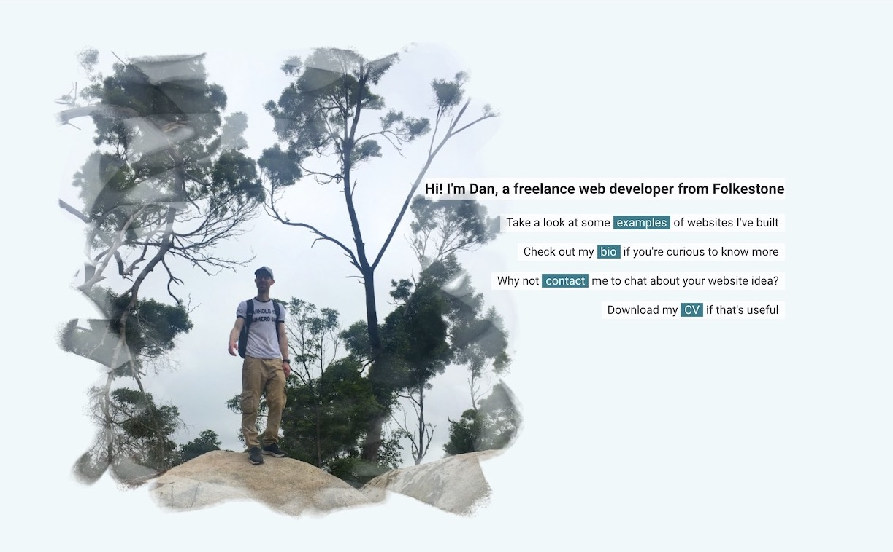

  

<h1 align="center">
  Personal Portfolio v1 (deprecated)
</h1>

[Visit live site](https://personal-portfolio-v1.netlify.com/)

My first attempt at a personal portfolio website. This site was built mostly to get familiar with Nunjucks templating, and also to attempt a more original layout and image style.

It's based on my static site boilerplate **For-the-Whim**. It's hosted with Netlify, using a continuous deployment set-up from this repo.
